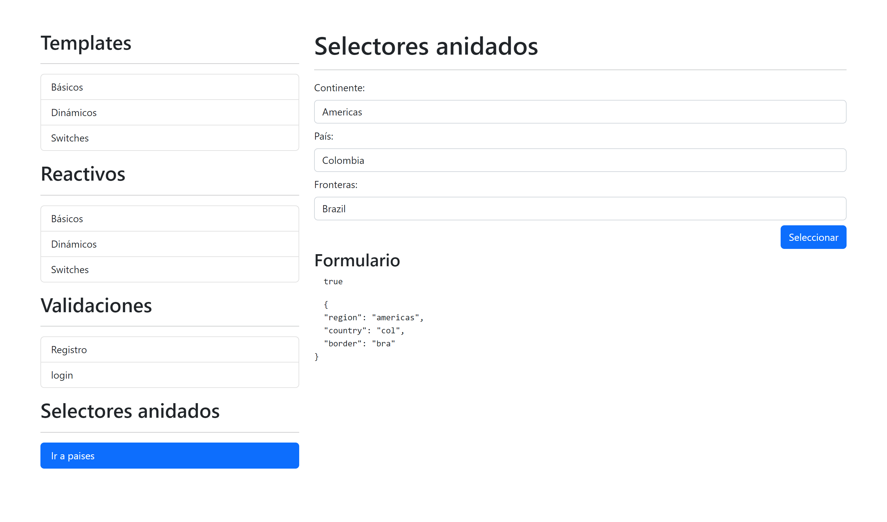

# AngularFormApp

## Descripción 📖

Aplicación para el manejo de formularios en angular, se utilizan tanto **formularios template** (FormsModule) y **formularios reactivos** (ReactiveFormsModule).
En ambos se emplean desde formularios básicos, dinámicos y el manejo de switches, así mismo se utilizan validaciones en cada uno de los formularios.

Al final se realiza un proyecto de selectores anidados, en los que se hace peticiones a la api de [REST COUNTRIES](https://restcountries.com/) y en base al continente que se seleccione en el selector se mostraran selectores dinámicos de los países y también de sus países fronterizos.

## Temas puntuales 📌

### Template Form

- FormsModule
- ViewChild
- Validaciones
- Limpiar formularios
- Formularios dinámicos
- Template: Radio, Check y Switches

### Reactive Form

- FormBuilder
- Forms Validators
- FormArray
- Formularios reactivos: Switches
- Validaciones con expresiones regulares
- Validaciones personalizadas
- Validar contraseñas iguales
- Mensajes de error personalizados
- Selectores anidados
- Uso combineLatest, para multiples peticiones

## Tecnologias utilizadas 🛠

- [Angular](https://angular.io/) versión 14.0.0
- [Bootstrap](https://getbootstrap.com/) versión 5.2.0
